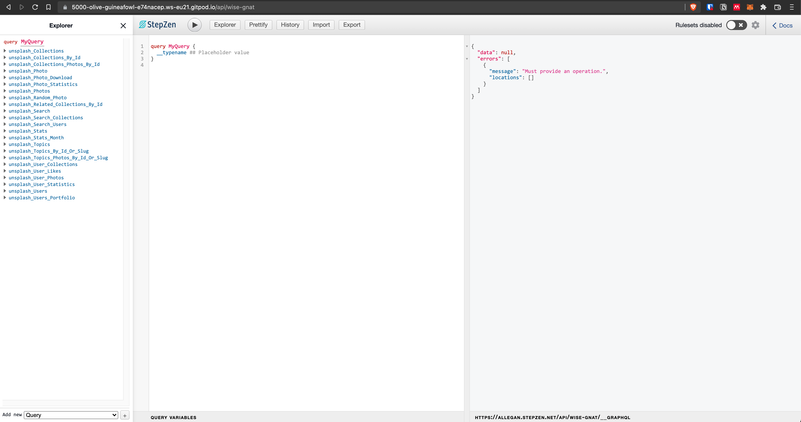

# Setup Stepzen CLI

Installing and logging in is quite straight forward

    npm install -g stepzen

    stepzen login

After using stepzen start in `03/stepzen/` folder, the gitpod provides a nice UI already!

