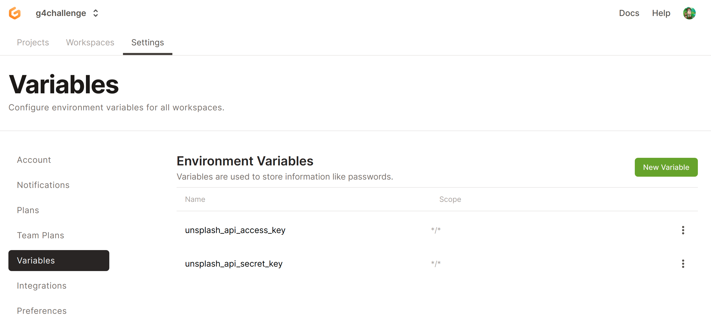

# Day 05 - Environment Secrets?

Secrets in Cloud-native Environments are "harder" to manage securely, overall, we do not want to expose our secret within the GitPod Repository.

This can be done through GitPods Secrets.

